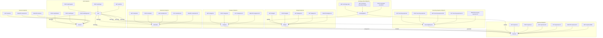
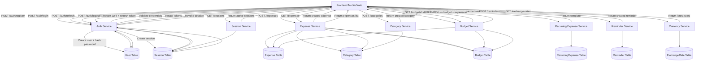

```mermaid
graph TD
    %% Domain Models
    USER[User]
    CATEGORY[Category]
    EXPENSE[Expense]
    RECURRING[RecurringExpense]
    BUDGET[Budget]
    REMINDER[Reminder]
    SESSION[Session]
    EXCHANGERATE[ExchangeRate]

    %% Relationships
    USER -->|has many| CATEGORY
    USER -->|has many| EXPENSE
    USER -->|has many| BUDGET
    USER -->|has many| RECURRING
    USER -->|has many| REMINDER
    USER -->|has many| SESSION

    CATEGORY -->|assigned to| EXPENSE
    BUDGET -->|contains| EXPENSE
    RECURRING -->|generates| EXPENSE
    EXCHANGERATE -->|used by| EXPENSE
    EXCHANGERATE -->|used by| BUDGET

    %% API Endpoints
    subgraph "Auth Endpoints"
        A1["POST /auth/register"]
        A2["POST /auth/login"]
        A3["POST /auth/refresh"]
        A4["POST /auth/logout"]
        A5["POST /auth/logout-all"]
        A6["GET /auth/me"]
        A1 --> USER
        A2 --> USER
        A3 --> SESSION
        A4 --> SESSION
        A5 --> SESSION
        A6 --> USER
    end

    subgraph "Expense Endpoints"
        E1["GET /expenses"]
        E2["POST /expenses"]
        E3["GET /expenses/:id"]
        E4["PUT /expenses/:id"]
        E5["DELETE /expenses/:id"]
        E6["GET /expenses/filter"]
        E1 --> EXPENSE
        E2 --> EXPENSE
        E3 --> EXPENSE
        E4 --> EXPENSE
        E5 --> EXPENSE
        E6 --> EXPENSE
    end

    subgraph "Recurring Expense Endpoints"
        R1["GET /recurring-expenses"]
        R2["POST /recurring-expenses"]
        R3["GET /recurring-expenses/:id"]
        R4["PUT /recurring-expenses/:id"]
        R5["DELETE /recurring-expenses/:id"]
        R1 --> RECURRING
        R2 --> RECURRING
        R3 --> RECURRING
        R4 --> RECURRING
        R5 --> RECURRING
    end

    subgraph "Budget Endpoints"
        B1["GET /budgets"]
        B2["POST /budgets"]
        B3["GET /budgets/:id"]
        B4["PUT /budgets/:id"]
        B5["DELETE /budgets/:id"]
        B1 --> BUDGET
        B2 --> BUDGET
        B3 --> BUDGET
        B4 --> BUDGET
        B5 --> BUDGET
    end

    subgraph "Reminder Endpoints"
        RE1["GET /reminders"]
        RE2["POST /reminders"]
        RE3["GET /reminders/:id"]
        RE4["PUT /reminders/:id"]
        RE5["DELETE /reminders/:id"]
        RE1 --> REMINDER
        RE2 --> REMINDER
        RE3 --> REMINDER
        RE4 --> REMINDER
        RE5 --> REMINDER
    end

    subgraph "Category Endpoints"
        C1["GET /categories"]
        C2["POST /categories"]
        C3["PUT /categories/:id"]
        C4["DELETE /categories/:id"]
        C1 --> CATEGORY
        C2 --> CATEGORY
        C3 --> CATEGORY
        C4 --> CATEGORY
    end

    subgraph "Session Endpoints"
        S1["GET /sessions"]
        S2["DELETE /sessions/:id"]
        S3["DELETE /sessions"]
        S1 --> SESSION
        S2 --> SESSION
        S3 --> SESSION
    end

    subgraph "Exchange Rate Endpoints"
        X1["GET /exchange-rates"]
        X2["GET /exchange-rates/:base/:target"]
        X3["POST /exchange-rates/fetch"]
        X1 --> EXCHANGERATE
        X2 --> EXCHANGERATE
        X3 --> EXCHANGERATE
    end
```

```mermaid
graph TD
    %% Frontend
    F[Frontend Mobile/Web]

    %% Auth Flow
    F -->|POST /auth/register| AS[Auth Service]
    AS -->|Create user + hash password| DBU[(User Table)]
    DBU --> AS
    AS -->|Return JWT + refresh token| F

    F -->|POST /auth/login| AS
    AS --> DBU
    AS -->|Validate credentials| F
    AS -->|Create session| DBS[(Session Table)]
    DBS --> AS

    F -->|POST /auth/refresh| AS
    AS --> DBS
    AS -->|Rotate tokens| F

    F -->|POST /auth/logout| AS
    AS --> DBS
    AS -->|Revoke session| F

    %% Expense Flow
    F -->|POST /expenses| ES[Expense Service]
    ES --> DBE[(Expense Table)]
    ES --> DBC[(Category Table)]
    ES --> DBB[(Budget Table)]
    ES -->|Return created expense| F

    F -->|GET /expenses| ES
    ES --> DBE
    ES --> DBC
    ES --> DBB
    ES -->|Return expenses list| F

    %% Recurring Expense Flow
    F -->|POST /recurring-expenses| RES[Recurring Expense Service]
    RES --> DBRE[(RecurringExpense Table)]
    RES -->|Return template| F

    %% Budget Flow
    F -->|POST /budgets| BS[Budget Service]
    BS --> DBB
    BS -->|Return created budget| F

    F -->|GET /budgets/:id| BS
    BS --> DBB
    BS --> DBE
    BS -->|Return budget + expenses| F

    %% Reminder Flow
    F -->|POST /reminders| RS[Reminder Service]
    RS --> DBR[(Reminder Table)]
    RS -->|Return created reminder| F

    %% Categories Flow
    F -->|POST /categories| CS[Category Service]
    CS --> DBC
    CS -->|Return created category| F

    %% Sessions Flow
    F -->|GET /sessions| SES[Session Service]
    SES --> DBS
    SES -->|Return active sessions| F

    %% Exchange Rates Flow
    F -->|GET /exchange-rates| XRS[Currency Service]
    XRS --> DBX[(ExchangeRate Table)]
    XRS -->|Return latest rates| F
```