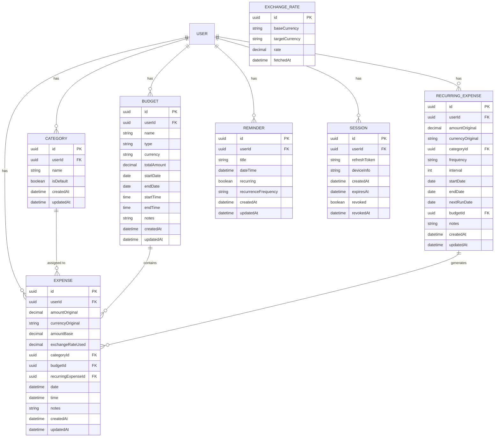

# Domain Models ERD

```mermaid
erDiagram
    USER ||--o{ CATEGORY : "has"
    USER ||--o{ EXPENSE : "has"
    USER ||--o{ BUDGET : "has"
    USER ||--o{ RECURRING_EXPENSE : "has"
    USER ||--o{ REMINDER : "has"
    USER ||--o{ SESSION : "has"

    CATEGORY ||--o{ EXPENSE : "assigned to"

    BUDGET ||--o{ EXPENSE : "contains"

    RECURRING_EXPENSE ||--o{ EXPENSE : "generates"

    EXPENSE {
        uuid id PK
        uuid userId FK
        decimal amountOriginal
        string currencyOriginal
        decimal amountBase
        decimal exchangeRateUsed
        uuid categoryId FK
        uuid budgetId FK
        uuid recurringExpenseId FK
        datetime date
        datetime time
        string notes
        datetime createdAt
        datetime updatedAt
    }

    RECURRING_EXPENSE {
        uuid id PK
        uuid userId FK
        decimal amountOriginal
        string currencyOriginal
        uuid categoryId FK
        string frequency
        int interval
        date startDate
        date endDate
        date nextRunDate
        uuid budgetId FK
        string notes
        datetime createdAt
        datetime updatedAt
    }

    BUDGET {
        uuid id PK
        uuid userId FK
        string name
        string type
        string currency
        decimal totalAmount
        date startDate
        date endDate
        time startTime
        time endTime
        string notes
        datetime createdAt
        datetime updatedAt
    }

    CATEGORY {
        uuid id PK
        uuid userId FK
        string name
        boolean isDefault
        datetime createdAt
        datetime updatedAt
    }

    REMINDER {
        uuid id PK
        uuid userId FK
        string title
        datetime dateTime
        boolean recurring
        string recurrenceFrequency
        datetime createdAt
        datetime updatedAt
    }

    SESSION {
        uuid id PK
        uuid userId FK
        string refreshToken
        string deviceInfo
        datetime createdAt
        datetime expiresAt
        boolean revoked
        datetime revokedAt
    }

    EXCHANGE_RATE {
        uuid id PK
        string baseCurrency
        string targetCurrency
        decimal rate
        datetime fetchedAt
    }
```